# 여행을 정산하다, 여정
> 개발 기간 : 2024년 02월 19일 ~ 04월 05일 ( 7주 )
---

## 산출물
- <a href="./exec/요구사항_정의서.pdf" target="_blank"> 요구사항 정의서 </a>
- <a href="./exec/기능명세서.pdf" target="_blank"> 기능명세서 </a>
- <a href="./exec/화면정의서.pdf" target="_blank"> 화면정의서 </a>
- <a href="./exec/API_명세서.pdf" target="_blank"> API 명세서 </a>
- <a href="./exec/시스템아키텍처.png" target="_blank"> 시스템아키텍처 </a>
- [피그마](https://www.figma.com/file/No2M749xUEprmC5XbUSJfD/Orange?type=design&node-id=1%3A2&mode=dev&t=AA0BAFL045q1F2cW-1https://www.figma.com/file/No2M749xUEprmC5XbUSJfD/Orange?type=design&node-id=1%3A2&mode=dev&t=AA0BAFL045q1F2cW-1)
- <a href="./exec/여정_포팅_매뉴얼.docx" target="_blank"> 포팅 매뉴얼 </a>
- <a href="./exec/C203_여정_발표자료.pptx" target="_blank"> 발표자료 </a>
---

1. [Role](#role)
2. [기술 스택](#기술-스택)
3. [주요기능_서비스흐름](#주요-기능)
   - [카카오 로그인 및 생체인증,PIN번호 등록](#카카오-로그인-및-생체인증pin번호-등록)
   - [주계좌 등록 및 수정](#주계좌-등록-및-수정)
   - [메인 화면](#메인-화면)
   - [여행 그룹 생성 및 초대](#여행-그룹-생성-및-초대)
   - [정산 요청](#정산-요청)
   - [정산하기](#정산하기)
   - [여행 지도](#여행-지도)
---

## Role

| 이름   | 역할                                                         |
| ------ | ------------------------------------------------------------ |
| 김지연 | **팀장** **프론트엔드** |
| 김신영 | **백엔드**    |
| 김민준 | **발표** **프론트엔드**                 |
| 박태호 | **백엔드** **인프라**  |
| 이현호 | **백엔드** |
| 전승혜 | **프론트엔드** |

---
## 기술 스택

### BackEnd
- JAVA 17
- SpringBoot 3
- Spring Security 6.2.1
- Spring Data JPA

### FrontEnd
- Flutter (14.16.0)
- Dart (3.3.1)
- DIO (5.4.1)

### DB
- MariaDB (10.6.17)
- Redis 

### INFRA
- 환경 배포 환경 : Amazon EC 2 Ubuntu
- CI/CD : Jenkins
- Nginx
- Docker

### 외부 서비스
- Amazon S3
- Firebase FCM
- Kakao Login
---

## 주요 기능
> 소셜로그인, 주계좌등록, 여행 그룹에 결제 금액 정산요청,  OCR 영수증 등록, 영수증 일괄 등록, FCM알림
 
1. 싸피 은행에 있는 계좌를 통해 주계좌를 설정
2. 주계좌의 거래내역을 추적하여 결제한 내역을 그룹원들에게 정산 요청하는 기능
3. 3여행 그룹 생성 및 그룹원 초대 기능
4. OCR을 이용한 간편 영수증 등록기능
5. 영수증 일괄 등록으로 내 거래내역에 자동으로 매칭.
6. 잘못된 정산 요청내역 수정 기능
7. 푸시알림을 통해 회원의 모든 기기에서 알림 수신 기능

### 카카오 로그인 및 생체인증,PIN번호 등록

> 카카오 로그인이 성공하면 회원이 사용할 간편 비밀번호를 입력할 수 있습니다. 회원의 금융정보를 불러온다. (싸피_마이데이터)
 

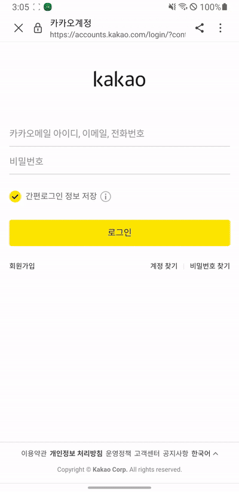
---

### 주계좌 등록 및 수정

>은행에서 계좌 목록을 불러와 주계좌를 설정할 수 있습니다.  계좌마다 거래내역, 잔액 정보등을 확인할 수 있습니다.

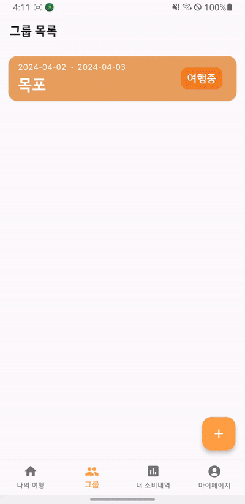 &nbsp; &nbsp;
---
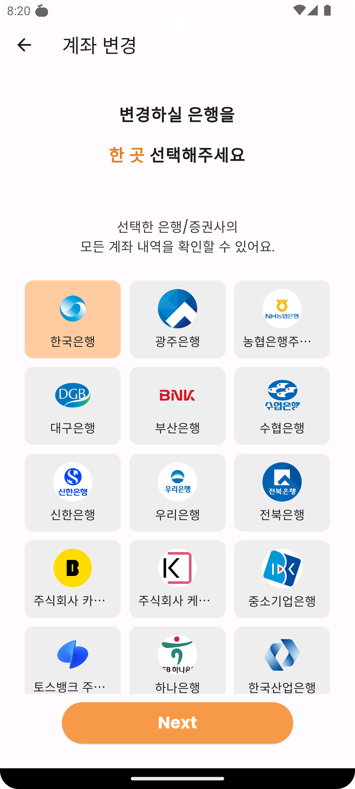 &nbsp; &nbsp;
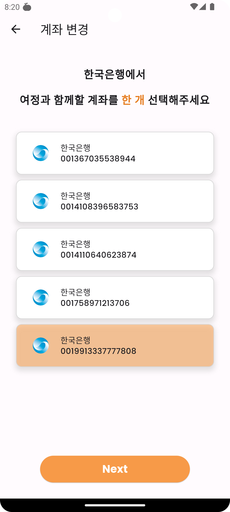

---

### 메인 화면
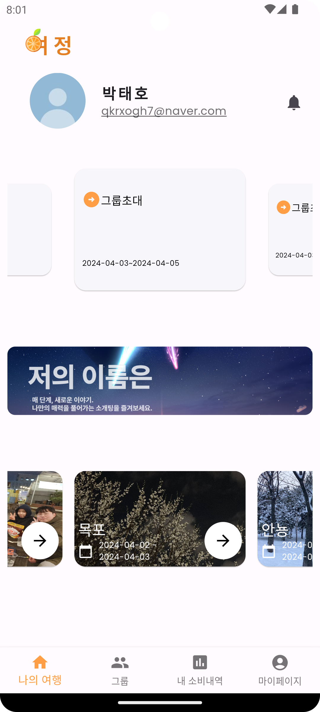 &nbsp; &nbsp;
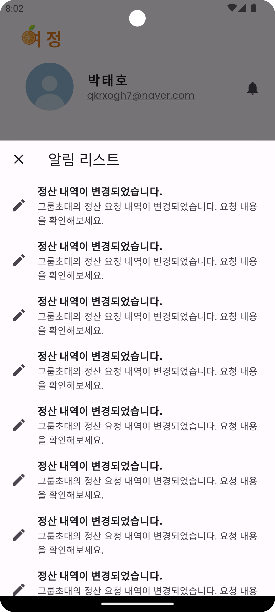

---

### 여행 그룹 생성 및 초대

> 여행 그룹 생성 항목 : 그룹이름, 여행 테마, 여행기간 등을 설정할 수 있습니다.
 
> 친구를 이메일로 조회 후 초대할 수 있습니다.
---
 

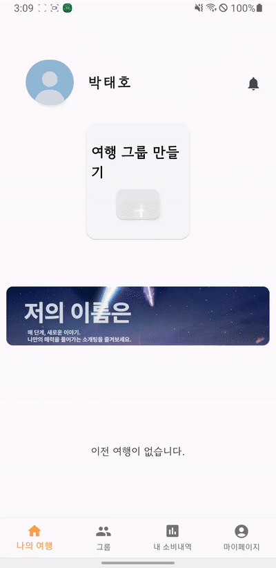 &nbsp; &nbsp;
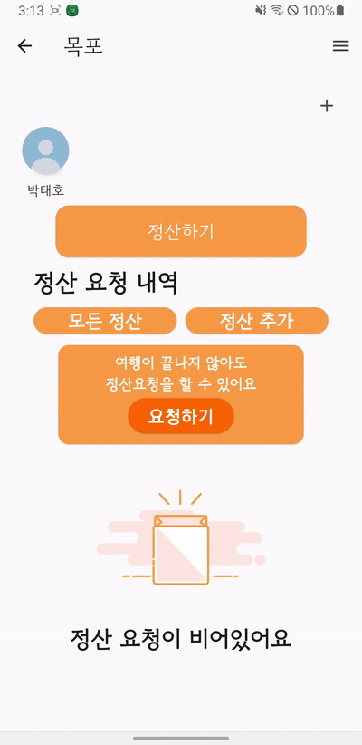 
---
 
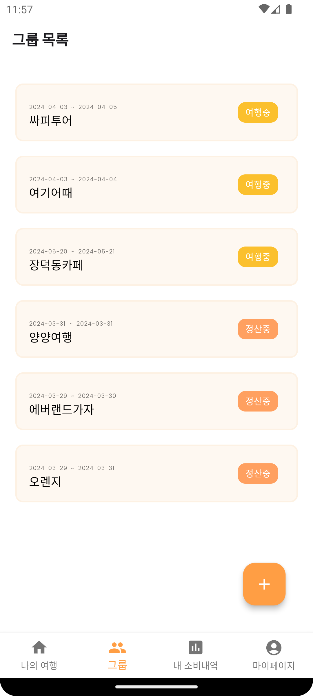 &nbsp; &nbsp;
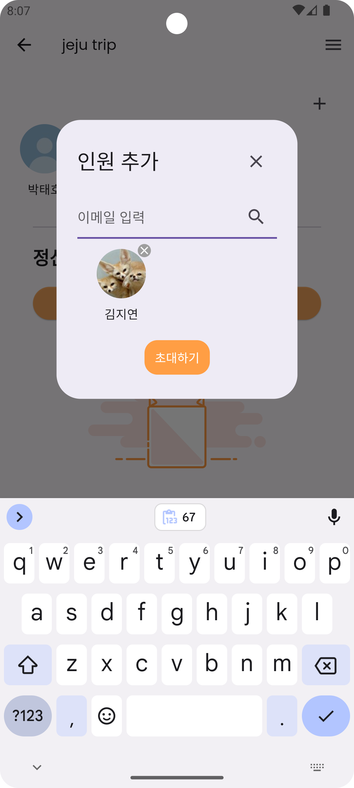 &nbsp; &nbsp;
 

---

### 정산 요청

> 영수증 등록 및 현금결제를 추가하여 정산 내역에 포함할 수 있습니다.
 

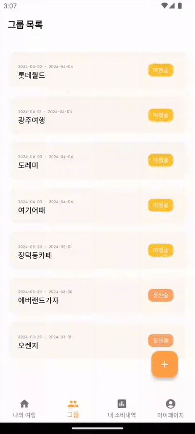 &nbsp; &nbsp;

---

 &nbsp; &nbsp;
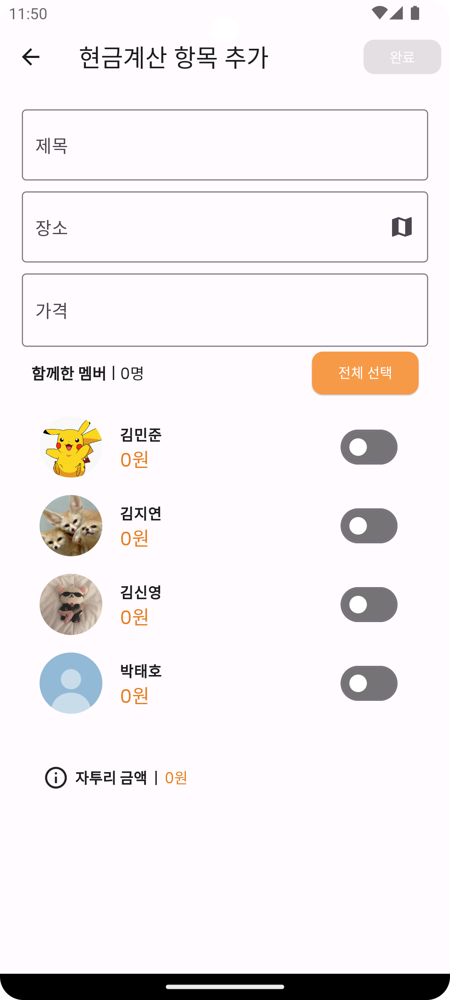 &nbsp; &nbsp;
 &nbsp; &nbsp;
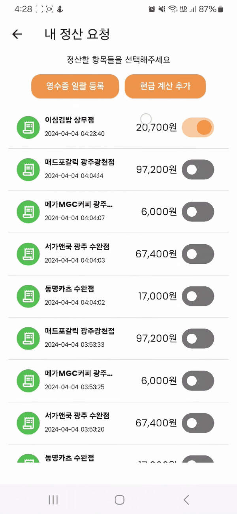 &nbsp; &nbsp;
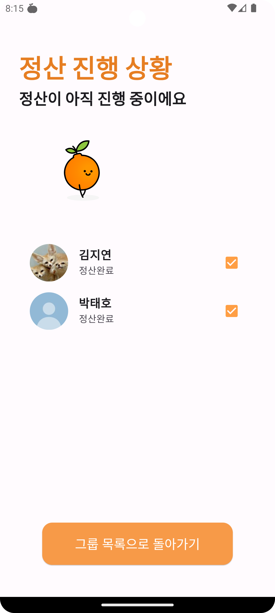 &nbsp; &nbsp;

### 정산하기
> 마지막으로 정산하기를 누른 인원은 자투리 금액 당첨됩니다.  그룹원들의 계좌에 잔액이 충분하다면 정산이 진행되며,  완료후 푸시알림으로 확인할 수 있습니다.
 

 &nbsp; &nbsp;
 

---
> **요청받은 정산 내역 수정** 그룹원이 요청한 정산내역에 틀린부분이 발견된다면 한번 더 수정할 수 있습니다.

 
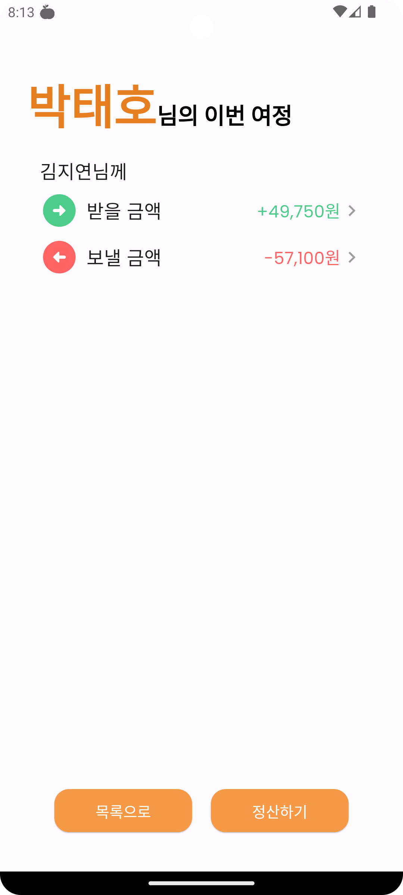 &nbsp; &nbsp;
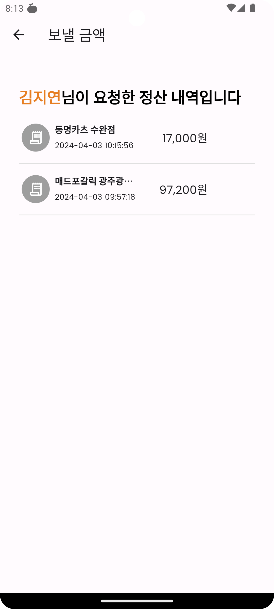 &nbsp; &nbsp;
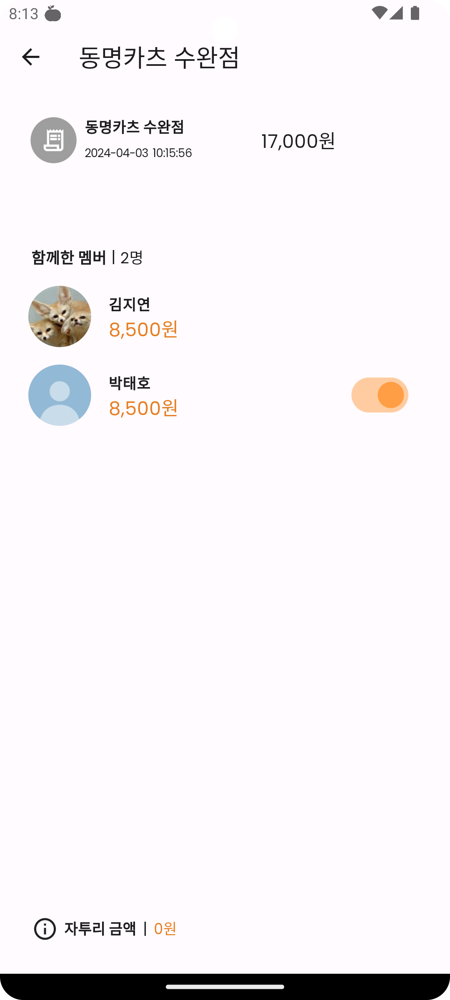 &nbsp; &nbsp;

---

> **진행 과정** 
 
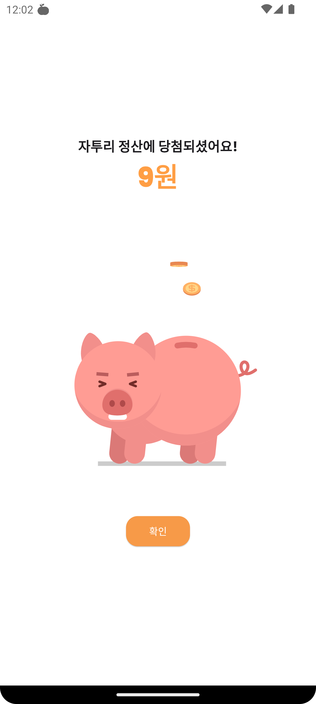 &nbsp; &nbsp;
 &nbsp; &nbsp;
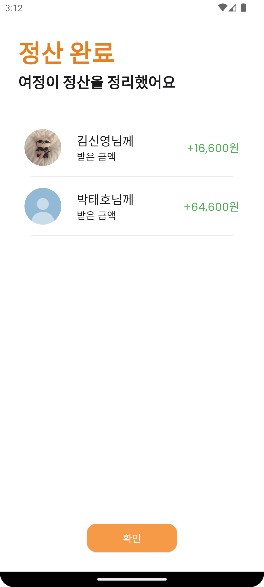 &nbsp; &nbsp;

---

### 여행 지도
> 여행이 끝나고 정산까지 완료되었다면 여행동안 다녀온 장소를 확인할 수 있습니다.

 

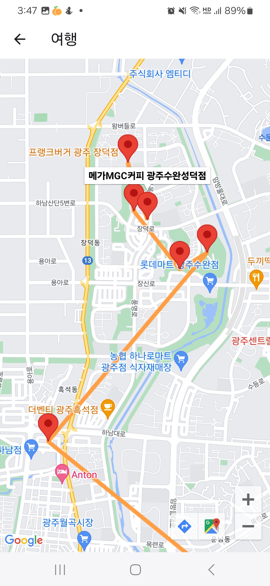 &nbsp; &nbsp;
 

---
